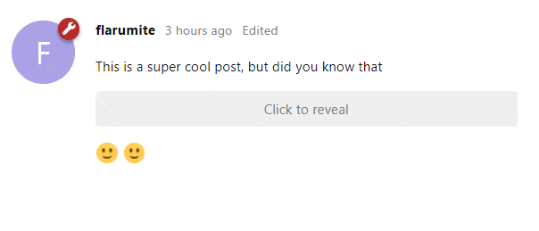
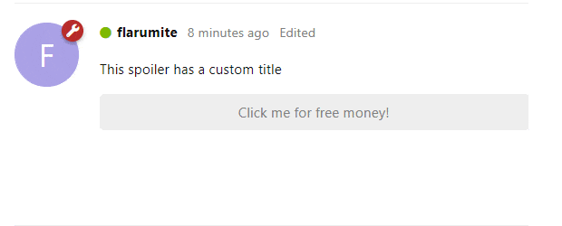

# Simple Spoilers

 [](https://packagist.org/packages/flarumite/simple-spoilers)

A [Flarum](http://flarum.org) extension. Adds simple spoilers to your forum. Uses pure HTML and CSS with absolutely no JavaScript.

Supports [FriendsOfFlarum's Night Mode](https://github.com/friendsofflarum/nightmode).

### Browser support

As this extension uses the [`<details>` and `<summary>` elements](https://developer.mozilla.org/en-US/docs/Web/HTML/Element/details), this extension is [incompatible with Internet Explorer](https://caniuse.com/details). IE has approximately 1% of market share in the modern world, and many websites are beginning to drop support for it.

### Usage

Spoilers are available in two versions: normal and customised title. The normal spoilers use the values in the locale file as titles (button text), whereas the customised title version allows users to add their own title to replace the localised versions.

#### Normal spoiler



```
[spoiler]
Some content
[/spoiler]
```

#### Spoiler with custom title



```
[spoiler title=My cool title]
Some content
[/spoiler]
```

### Installation

Use [Bazaar](https://discuss.flarum.org/d/5151-flagrow-bazaar-the-extension-marketplace) or install manually with composer:

```sh
composer require flarumite/simple-spoilers
```

### Updating

```sh
composer update flarumite/simple-spoilers
```

### Links

- [Packagist](https://packagist.org/packages/flarumite/spoilers-and-accordions)
